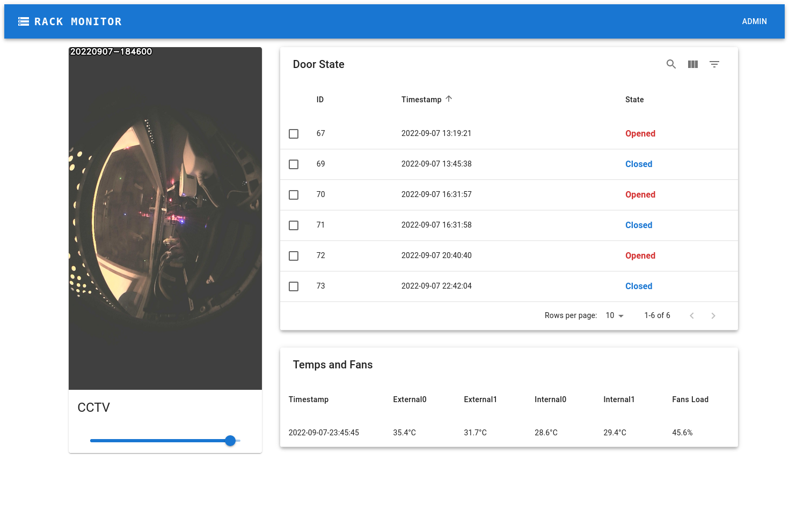
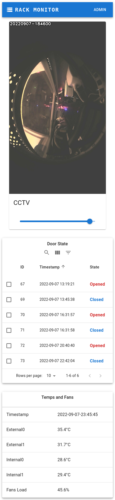
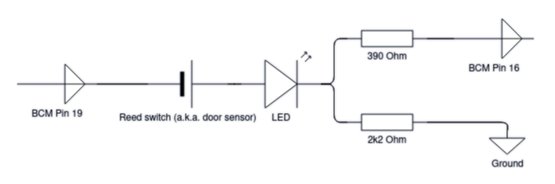
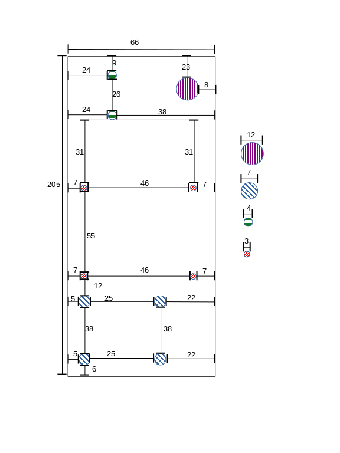
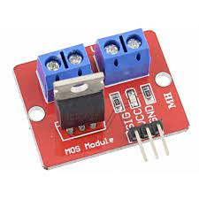
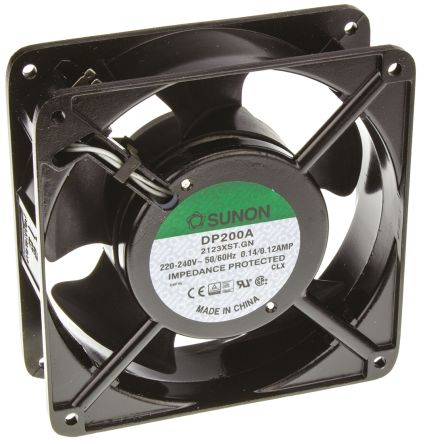
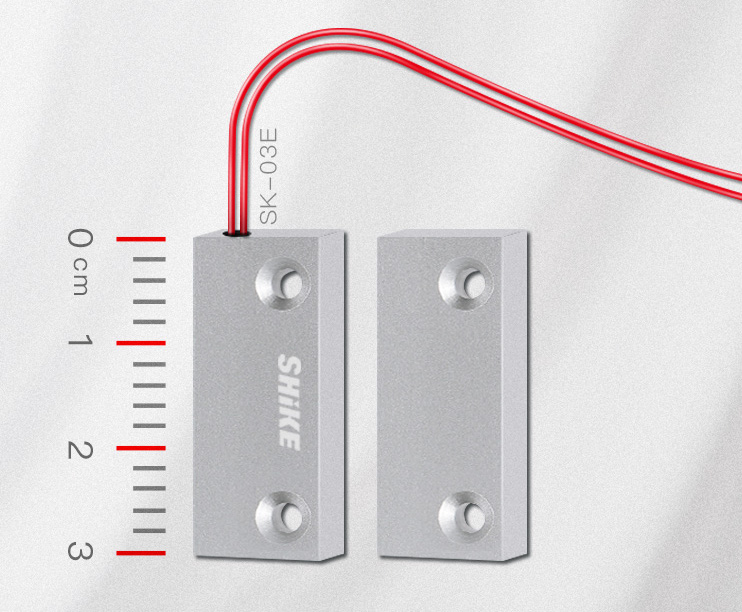
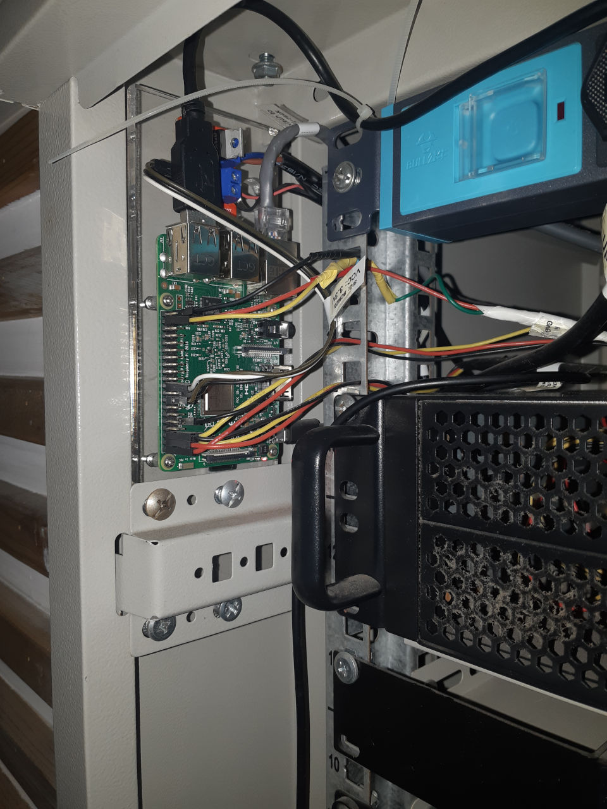
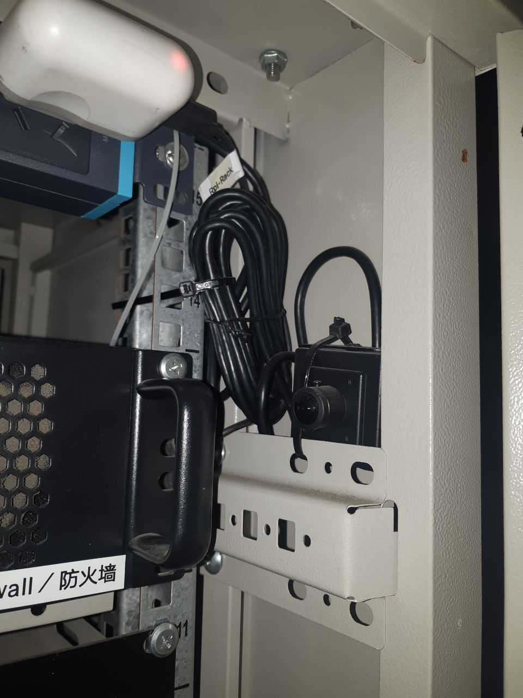
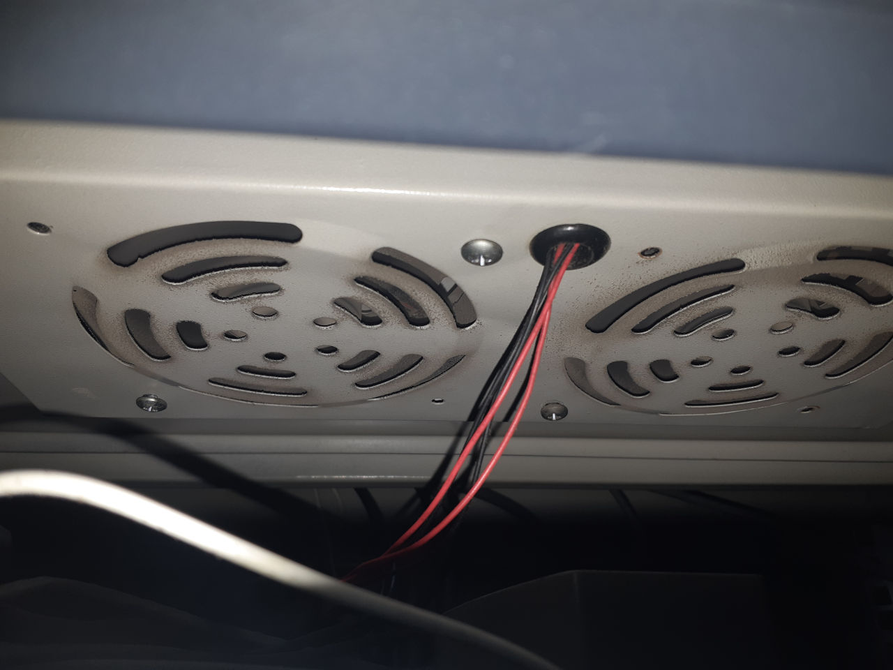

# Rack daemon

A tool intended to run on embedded systems to:

1. Read temperature values from four DS18B20 temperature sensors;
1. Control two Sunon cooling fans based on ambient and cabinet temperature readings with a IRF520 MOS Driver Module;
1. Detect cabinet door opening with a reed switch (a.k.a. door sensor);
1. Read from an USB IPCam and show real-time image (depends on
[camera-server](https://github.com/alex-lt-kong/camera-server));
1. A front-end single-page application to demonstrate all these.

## Environment and dependency

### Back-end

* Common libs: `apt install libsqlite3-dev`
* `cJSON` for JSON support: `apt install libcjson-dev`
* `libmicrohttpd` for HTTP support: `apt install libmicrohttpd-dev`
* `Pigpio`: used to manipulate GPIO pins.

```
git clone https://github.com/joan2937/pigpio
cd ./pigpio
mkdir ./build
cd ./build
cmake ../
make
make install
```

* Add path to `LD_LIBRARY_PATH`: `export LD_LIBRARY_PATH=$LD_LIBRARY_PATH:/usr/local/lib/:/usr/local/lib/aarch64-linux-gnu/`.

* `OpenCV`: Install following
[this link](https://github.com/alex-lt-kong/camera-server/blob/main/helper/build-notes.md).

#### Quality assurance

* Instead of `cmake ../`, run `cmake .. -DBUILD_ASAN=ON` /
`cmake .. -DBUILD_UBSAN=ON` to test memory/undefiend behavior error with
AddressSanitizer / UndefinedBehaviorSanitizer.
* The repo is also tested with `Valgrind` from time to time:
`valgrind --leak-check=yes --log-file=valgrind.rpt ./build/rd`.


### Front-end

* `npm install`
* `node babelify.js --prod`


## Gallery

### Software

<p float="left">
        
    
</p>

### Hardware

#### Wiring Diagram
##### Door sensor


##### Fans controller
Undocumented

#### Raspberry Pi Rack Mount Design



#### Components
##### IRF520 MOS Driver Module


##### Sunon Cooling Fan x2


##### Door sensor


#### Installation
##### Raspberry Pi and its rackmount
    

##### IPCam


##### Cooling Fans

