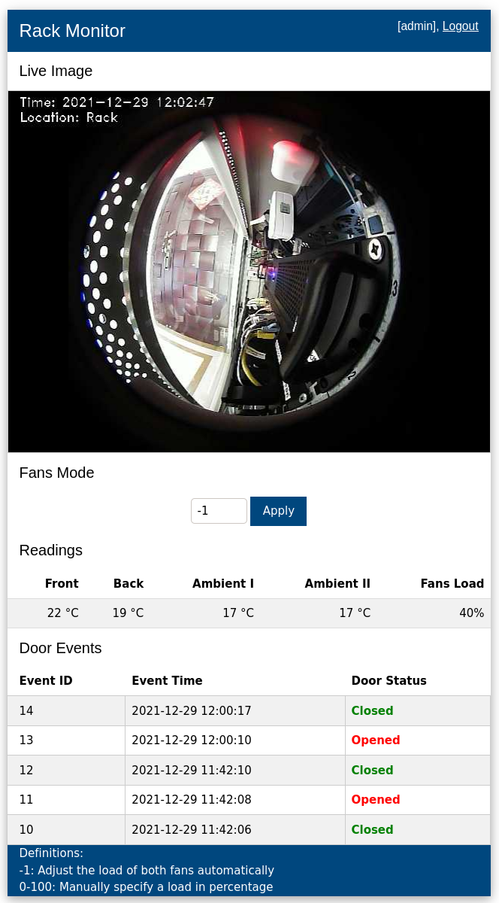
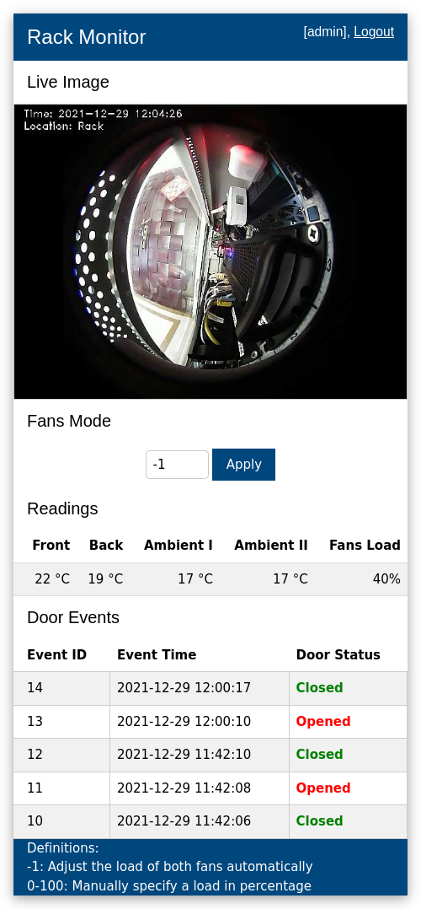

# rack-monitor

A tool developed in Python to:

1. Read temperature values from four DS18B20 temperature sensors;
1. Control two Sunon cooling fans based on ambient and cabinet temperature readings with a IRF520 MOS Driver Module;
1. Detect cabinet door opening with a reed switch (a.k.a. door sensor);

# Screenshots

        
    

# Hardware

## Wiring Diagram
### Door sensor

### Fans controller
Undocumented

## Raspberry Pi Rack Mount Design

## Components
### IRF520 MOS Driver Module

### Sunon Cooling Fan x2

### Door sensor

## Installation

        
    
    

